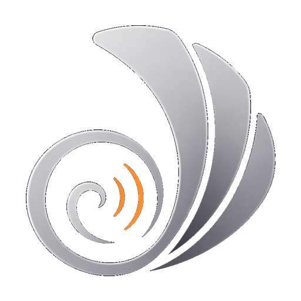

# VoiceShell · 声壳

**Speak Freely. Stay Private.**

[官网 / Website](https://voiceshell.tech) · [下载 / Download](https://voiceshell.tech/downloads/) · [文档 / Docs](docs/)

---

## 这是什么 / What is it

VoiceShell（声壳）让你用**极低音量、近乎耳语**地说话，软件实时把它转成文字、再用**你自己的声音**以正常音量复述出来，送进会议软件当麦克风。开放式办公室、家里、深夜——都能安静地开会和输入。

VoiceShell lets you speak in a **near-whisper**. It transcribes your quiet voice in real time and re-synthesizes it in **your own voice** at normal volume, feeding it into your meeting app as the microphone — so you can talk in open offices, at home, or late at night without being overheard.

## 主要能力 / Features

- 🤫 **静默语音输入** — 近耳语说话，输出正常音量的你本人声音
- 🎧 **会议直连** — 通过虚拟声卡（VB-Cable）接入 腾讯会议 / 飞书 / Zoom 等
- ⌨️ **语音听写** — 说话即出字，支持中英混说
- ✨ **AI 整理** — 把口水话自动整理成清晰的文字 / 要点
- 📝 **会议转写与笔记** — 记录并整理会议内容
- 📚 **自定义词典 / 纠错** — 改一次就记住，下次自动纠正

## 下载 / Download

| 平台 Platform | 状态 Status | 链接 Link |
|---|---|---|
| macOS（Apple Silicon） | 已签名 + 公证 Signed & notarized | **[voiceshell.tech/downloads](https://voiceshell.tech/downloads/)** |
| Windows | 内测版 Beta | [voiceshell.tech/downloads](https://voiceshell.tech/downloads/) |

> 安装与会议声音路由（VB-Cable）设置见 [docs/](docs/)。

## 关于本仓库 / About this repo

本仓库用于**对外展示、文档与发布说明**，**不包含应用核心源代码**（VoiceShell 为闭源商业软件）。
This repository hosts the **public website, documentation, and release notes only**. It does **not** contain the application source code — VoiceShell is proprietary, closed-source software.

## 隐私 / Privacy

VoiceShell 的所有语音识别与处理均**完全在本地运行**，不上传任何音频或文字内容到外部服务器。你的声音只在你的设备上。

All speech recognition and processing runs **entirely on-device**. No audio or transcription data is ever sent to external servers. Your voice stays on your machine.

## 联系 / Contact

微信 / WeChat：**15515980026**

---

© 2026 VoiceShell. All rights reserved. 详见 [LICENSE](LICENSE)。
